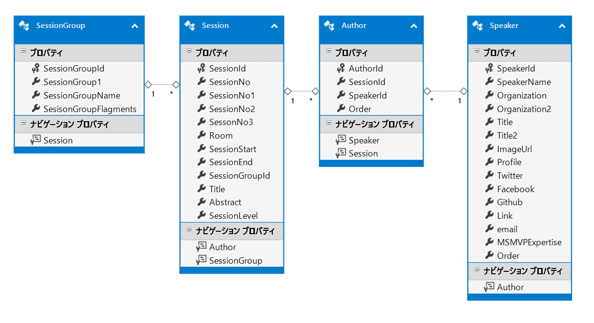

# コンテンツ情報更新ツール

## 概要

このツールは仙台IT文化祭のWebPage更新用ツールです。  
このツールによって更新されるのは以下のファイルになります。  
* スピーカー情報 (data/speakers.yml)
* セッション情報 (source/sessions/items/*.md)
* タイムテーブル (source/schedule/index.html.slim)
このツールの実行にはSQL Serverが必要になります。

## 準備

### データべースの構造

このツールの実行はあらかじめデータベースに以下のテーブルを作成しています。

| Table | Description |
|:-|:-|
|Session|セッション情報。セッションに関する概要・実施時間・実施場所などの情報が格納されている|
|SessionGroup|セッショングループ情報。各セッションのカテゴライズ情報が格納されている|
|Author|セッションスピーカー。セッションに紐づくスピーカーの情報が格納されている|
|Speaker|スピーカー情報。スピーカー名や組織、肩書などのスピーカー情報が含まれている|



### プログラムの実行準備

プログラムはConsoleアプリケーションになっており、実行に必要なパラメータはすべてconfigファイルに記入する必要があります。

configファイルは2種類あります。

* ContentScriptCreator.exe.config - ファイルパスなどの情報を記入
* データベース接続文字列を記入

#### ContentScriptCreator.exe.config

前述のとおり、この設定ファイルにはファイルパスの情報を記入します。

このツールでは以下の５つのファイル情報が必要になります。

|Setting Name| Value |
|:-|:-|
|SpeakerYml|スピーカー情報ファイルパス。指定されたファイルパスにspeakers.ymlを出力します。|
|TimetablePath|タイムテーブルファイルパス。指定されたファイルパスにタイムテーブルのslimファイルを出力します。|
|TimeTableCommonHeaderFilename|タイムテーブルの先頭に出力するslimファイルです。このファイルに続けてタイムテーブルへのリンクを出力します。|
|TimeTableHeaderFilename|タイムテーブルのフラグメントへのリンクを出力後、こちらのファイルを出力します。現在はタイムテーブル図が出力されています。|
|SessionInfoPath|セッション情報ファイルの出力先。指定されたフォルダにあるファイルをすべて削除し、新たにDBから読み取って生成したセッションファイルを格納します。|


以下が設定ファイルの該当箇所です。```<value>```要素のコンテンツ領域を修正します。
``` XML
  <userSettings>
    <ContentScriptCreator.Properties.Settings>
      <setting name="SessionInfoPath" serializeAs="String">
        <value>D:\Repos\sendaiitfes2017\source\sessions\items</value>
      </setting>
      <setting name="TimetablePath" serializeAs="String">
        <value>D:\Repos\sendaiitfes2017\source\schedule\index.html.slim.new</value>
      </setting>
      <setting name="SpeakerYml" serializeAs="String">
        <value>D:\Repos\sendaiitfes2017\data\speakers.yml</value>
      </setting>
      <setting name="TimeTableCommonHeaderFilename" serializeAs="String">
        <value>.\CommonHeader.html.slim</value>
      </setting>
      <setting name="TimeTableHeaderFilename" serializeAs="String">
        <value>.\TimeTableHeader.html.slim</value>
      </setting>
    </ContentScriptCreator.Properties.Settings>
  </userSettings>
```

#### 